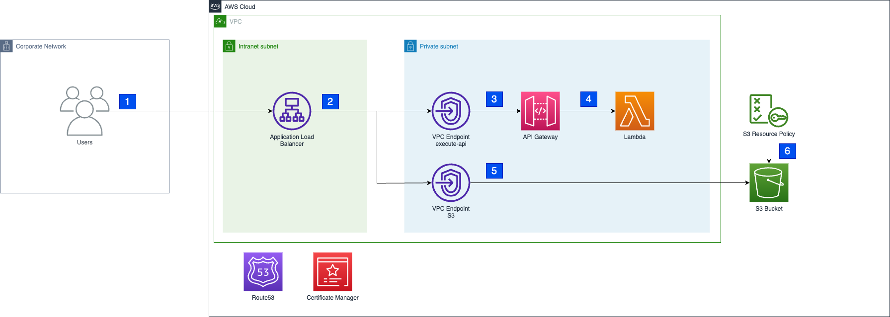

<!--
 Copyright Amazon.com, Inc. or its affiliates. All Rights Reserved.
 SPDX-License-Identifier: MIT-0
-->

# S3 Upload / Download through Private Network

This repository demonstrates how to interact with Amazon Simple Storage Service (S3) from a private network without traversing the internet to download files using pre-signed URLs. For example, this may be required for use-cases, where data is sensitive in nature and needs to be protected through network isolation. This solution can be embedded into internal web interfaces or used as an API.


## Architecture Diagram

The following architecture shows the resources provisioned with this sample project.



1. Users from the corporate network can access the load balancer through an internal domain name. We assume that a connection exists between the corporate network and the intranet subnet in the AWS account for example through a Direct Connect.
2. The application load balancer routes incoming traffic either towards the API Gateway to generate pre-signed URLs to download or upload data to S3, or routes traffic towards the VPC endpoint of the S3 bucket. In both scenarios, requests are routed internally and do not need to traverse the internet.
3. API Gateway exposes resources and endpoints to interact with the S3 bucket. In this example, we provide an endpoint to download files from S3, but this could be extended for upload functionality as well.
4. The lambda function generates the pre-signed URL to download a file from S3 using the domain name of the ALB instead of the public s3 domain.
5. Once the user receives the pre-signed URL, it can be used to download the file from S3 using the ALB. The ALB includes a default route to send traffic that's not for the API towards the VPC endpoint of the S3 bucket.
6. The VPC endpoint will route the pre-signed URL with the custom domain name to the s3 bucket. The S3 bucket needs to have the same name as the domain.


## Walkthrough

### Repository structure

```
terraform                           # terraform setup to provision all the modules of the solution
terraform/example.tfvars            # example variables to use the solution.
terraform/modules                   # terraform modules required to deploy the solution
terraform/modules/api/dependencies  # Python code for an example lambda to download files
```

### Pre-requisites

* python >= 3.11
* [terraform](https://developer.hashicorp.com/terraform/downloads?product_intent=terraform) >= 1.6
* [AWS CLI](https://docs.aws.amazon.com/cli/latest/userguide/cli-chap-welcome.html)
* VPC with a subnet deployed in AWS account that is connected to the corporate network (e.g. through Direct Connect)

### Usage

1. **Ensure** to have AWS credential renewed and access to your account.<br>How to do that is documented [here](https://docs.aws.amazon.com/cli/latest/userguide/cli-configure-files.html)
2. **Explore** the `terraform/example.tfvars` and adapt to your needs the required parameters.
3. **Change** into the terraform folder `cd terraform`
4. **Execute** terraform and passing in the variables adapted in point 2: `terraform apply -var-file="example.tfvars"`
5. **Check** if the resources on the diagram above were deployed successfully.
6. **Upload** a file to S3 to create a test scenario for the file downloa via the AWS console or the following command: `aws s3 cp /path/to/testfile s3://your-bucket-name/testfile`
7. **Execute** a request towards the ALB to create a pre-signed URL for the test file using [awscurl](https://github.com/okigan/awscurl) (to create a valid signature from your credentials which will be validated by API Gateway): `awscurl https://your-domain-name/api/get_url?key=testfile`
8. **Parse** the link form the response received from step 7 and open the pre-signed URL to download the file.
9. Please make sure to remove the resources if they are no longer required using `terraform destroy`

### Best Practices

* This sample architecture does not include monitoring of the deployed infrastructure. If your use case requires monitoring, evaluate to add it.
* This sample architecture does not include access logging with the application load balancer. If your use case requires to do so, consider enabling [load balancer access logs](https://docs.aws.amazon.com/elasticloadbalancing/latest/application/load-balancer-access-logs.html).
* This sample architecture uses [IAM Permissions](https://docs.aws.amazon.com/apigateway/latest/developerguide/permissions.html) to control the access to the API. Anyone with valid IAM credentials will be allowed to invoke the API. If your use case requires a more complex authorization model, evaluate to [use a different access control mechanism](https://docs.aws.amazon.com/apigateway/latest/developerguide/apigateway-control-access-to-api.html).
* This sample architecture does not include. If your use case requires additional input validation and an increased level of security, evaluate to [use AWS WAF to protect your API](https://docs.aws.amazon.com/apigateway/latest/developerguide/apigateway-control-access-aws-waf.html).

## Limitations

* Since the S3 bucket needs to have the exact name of the domain, it's required to check the [S3 naming rules](https://docs.aws.amazon.com/AmazonS3/latest/userguide/bucketnamingrules.html)

## Security

See [CONTRIBUTING](CONTRIBUTING.md#security-issue-notifications) for more information.

## License

This library is licensed under the MIT-0 License. See the LICENSE file.
